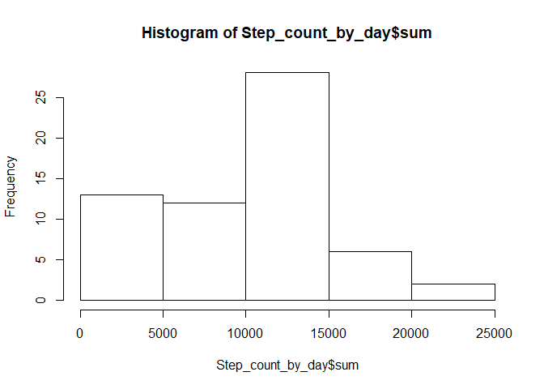
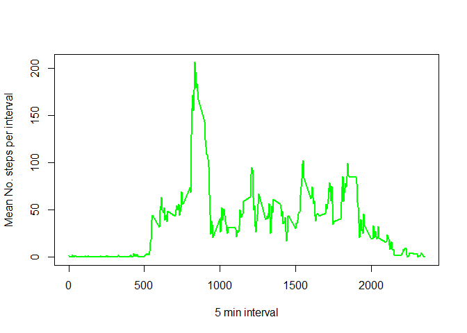
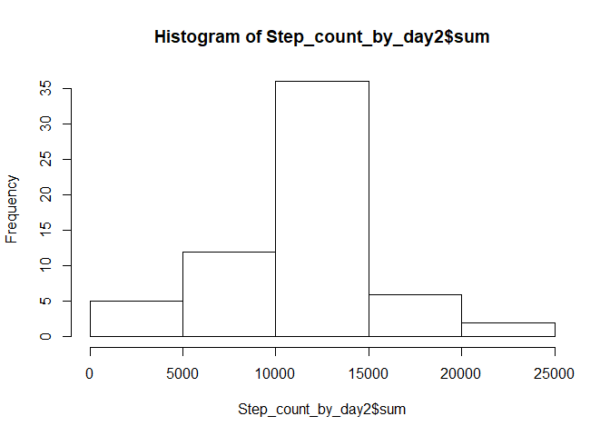
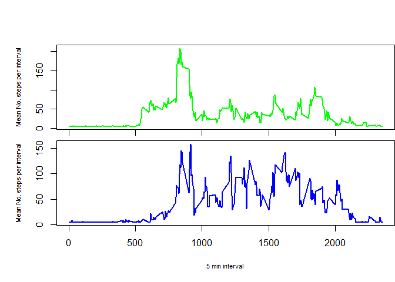

Reproducible Research Project 1
===============================

15 February 2020

## Set working directory, load knitr and rmarkdown packages

```r
setwd("C:/Users/u1069350/Desktop/Coursera/Reproducible research/Week 2- Course Project 1")
library(knitr)
library(rmarkdown)
```


## Load the assignment data

```r
activity <- read.csv("C:/Users/u1069350/Desktop/Coursera/Reproducible research/Week 2- Course Project 1/activity.csv")
```


## What is the mean total number of steps taken per day?
First we need to change the class of the date column

```r
activity$date <- as.Date(activity$date, "%Y-%m-%d")
```

Load the dplyr package for data manipulation

```r
library(dplyr)
```

```
## 
## Attaching package: 'dplyr'
```

```
## The following objects are masked from 'package:stats':
## 
##     filter, lag
```

```
## The following objects are masked from 'package:base':
## 
##     intersect, setdiff, setequal, union
```

Next let's summarize the number of steps taken each day

```r
Step_count_by_day <- activity %>%  group_by(date) %>% summarise(sum=sum(steps, na.rm=T))
Step_count_by_day
```

```
## # A tibble: 61 x 2
##    date         sum
##    <date>     <int>
##  1 2012-10-01     0
##  2 2012-10-02   126
##  3 2012-10-03 11352
##  4 2012-10-04 12116
##  5 2012-10-05 13294
##  6 2012-10-06 15420
##  7 2012-10-07 11015
##  8 2012-10-08     0
##  9 2012-10-09 12811
## 10 2012-10-10  9900
## # … with 51 more rows
```

Let's visualize the number of steps taken each day with a histogram

```r
hist(Step_count_by_day$sum)
```

<!-- -->

To calculate the mean and then the median number of steps each day

```r
mean(Step_count_by_day$sum)
```

```
## [1] 9354.23
```

```r
median(Step_count_by_day$sum)
```

```
## [1] 10395
```


## What is the average daily activity pattern?
First let's create a new dataframe of the mean number of steps for each 5 min time interval over the entire study period

```r
Step_mean_by_interval <- activity %>%  group_by(interval) %>% summarise(mean=mean(steps, na.rm=T))
Step_mean_by_interval
```

```
## # A tibble: 288 x 2
##    interval   mean
##       <int>  <dbl>
##  1        0 1.72  
##  2        5 0.340 
##  3       10 0.132 
##  4       15 0.151 
##  5       20 0.0755
##  6       25 2.09  
##  7       30 0.528 
##  8       35 0.868 
##  9       40 0     
## 10       45 1.47  
## # … with 278 more rows
```

Here is a time series plot of the mean number of steps taken in each 5 min time interval across all days

```r
plot(Step_mean_by_interval$interval, Step_mean_by_interval$mean, type="l", xlab = "5 min interval", ylab = "Mean No. steps per interval", col="green", lwd=2)
```

<!-- -->

Re-order the dataset from max to min mean number of steps per interval. Showing only the 5 time intervals with the most steps

```r
head(Step_mean_by_interval[rev(order(Step_mean_by_interval$mean)),])
```

```
## # A tibble: 6 x 2
##   interval  mean
##      <int> <dbl>
## 1      835  206.
## 2      840  196.
## 3      850  183.
## 4      845  180.
## 5      830  177.
## 6      820  171.
```
Here we see that interval # 835 has the greatest number of mean steps (206.17 steps).


## Imputing missing values
Calculate and report the total number of missing values in the dataset 

```r
sum(is.na(activity$steps))
```

```
## [1] 2304
```

There's a package for imputing data!
Let's load it
Impute missing values with the mean number of steps 

```r
library(imputeTS)
```

```
## Registered S3 method overwritten by 'quantmod':
##   method            from
##   as.zoo.data.frame zoo
```

Impute missing values with the mean number of steps 

```r
activity$steps2 <- na_mean(activity$steps)
```

Create a new dataframe with the missing step data imputed with the mean number of steps

```r
activity_noNA <- subset(activity, select= c(2:4))
```

Next let's re-calculate the number of steps taken each day

```r
Step_count_by_day2 <- activity_noNA %>%  group_by(date) %>% summarise(sum=sum(steps2, na.rm=T))
Step_count_by_day2
```

```
## # A tibble: 61 x 2
##    date          sum
##    <date>      <dbl>
##  1 2012-10-01 10766.
##  2 2012-10-02   126 
##  3 2012-10-03 11352 
##  4 2012-10-04 12116 
##  5 2012-10-05 13294 
##  6 2012-10-06 15420 
##  7 2012-10-07 11015 
##  8 2012-10-08 10766.
##  9 2012-10-09 12811 
## 10 2012-10-10  9900 
## # … with 51 more rows
```

Let's visualize the number of steps taken each day with a histogram

```r
hist(Step_count_by_day2$sum)
```

<!-- -->

To calculate the mean and then the median number of steps each day

```r
mean(Step_count_by_day2$sum)
```

```
## [1] 10766.19
```

```r
median(Step_count_by_day2$sum)
```

```
## [1] 10766.19
```
With the imputed data we see that both the mean and median number of steps are higher than the original dataset that had the NAs.


## Are there differences in activity patterns between weekdays and weekends?

Create a new column to indicate which days are weekdays and which are weekends

```r
activity_noNA$week_day <- ifelse(weekdays(activity_noNA$date) %in% c("Saturday", "Sunday"), "weekend", "weekday")
```

Split data into two dataframes, one for weekday and one for weekend & create summary dataframes with the mean number of steps for each 5 min time interval

```r
Weekday <- subset(activity_noNA, week_day == "weekday")
Weekend <- subset(activity_noNA, week_day == "weekend")
weekday_interval_mean <- Weekday %>%  group_by(interval) %>% summarise(mean=mean(steps2))
weekend_interval_mean <- Weekend %>%  group_by(interval) %>% summarise(mean=mean(steps2))
```

Panel plot of weekday (green) and weekend (blue) time series.

```r
par(mfrow=c(2,1))
par(mai=c(0.2,1,0.8,0))
plot(weekday_interval_mean$interval, weekday_interval_mean$mean, type="l", col="green", lwd=2,cex.lab =0.7,  xlab = " ", ylab = "Mean No. steps per interval", xaxt="n")
axis(1, labels=F)
par(mai=c(1,1,0,0))
plot(weekend_interval_mean$interval, weekend_interval_mean$mean, type="l", col="blue", lwd=2, cex.lab =0.7, xlab = "5 min interval", ylab = "Mean No. steps per interval")
```

<!-- -->
Yes there are differences in activity patterns. This individual is more active on weekends than weekdays!

